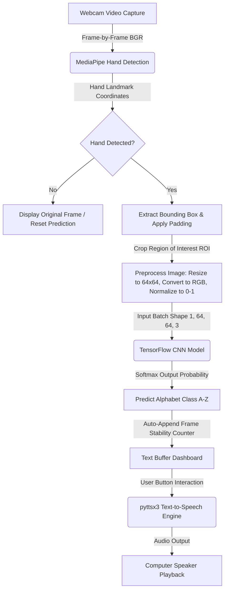

# SignBridge: Real-Time Indian Sign Language (ISL) to Speech System

SignBridge is a computer vision and deep learning-based capstone project designed to bridge the communication gap between individuals using Indian Sign Language (ISL) and non-signers. By utilizing a standard webcam, SignBridge performs real-time hand detection, extracts gesture regions, classifies them using a Convolutional Neural Network (CNN), compiles predictions into a text buffer, and converts that text to speech.

---

## 🏗️ System Architecture

The following block diagram represents the data flow pipeline of the SignBridge system:



---

## 🌟 Features (Version 1 MVP)

1. **Dual Webcam Input Modes**: 
   - **Live Webcam Mode**: Captures live frames from your physical camera, detects hands in real-time, and runs inference.
   - **Simulator Demo Mode**: Streams synthetic hand gesture frames with animated labels. This is highly useful for capstone demonstrations where a camera might be occupied or unavailable.
2. **Real-Time Hand Detection**: Extracts the hand Region of Interest (ROI) using **MediaPipe Hands** with bounding boxes.
3. **CNN-Based Classifier**: A Keras-based Convolutional Neural Network trained on 64x64x3 RGB images to recognize 26 classes (A-Z).
4. **Intelligent Text Generation**:
   - Maintains a real-time text buffer.
   - Includes an **Auto-Append** feature that filters out noise by verifying the gesture remains stable for a set number of frames before writing it.
   - Manual addition button, Space button, Backspace correction, and Clear buffer.
5. **Text-To-Speech (TTS)**: Converts translated sign sequences to voice using `pyttsx3` in an asynchronous background thread to prevent UI freezing.
6. **Premium Streamlit UI**: Custom dark glassmorphic styling, progress bars for gesture stability, live confidence ratings, and fully interactive layouts.

---

## 📂 Project Structure

```text
SignBridge/
├── dataset/                # Dataset folder containing folders A-Z for training images
├── models/                 # Folder where the trained classifier is saved (signbridge_cnn.h5)
├── backend/                # Backend modules
│   ├── __init__.py         # Package initialization
│   ├── hand_detector.py    # MediaPipe hand detection and cropping logic
│   ├── model_utils.py      # TensorFlow model loader and image preprocessing
│   └── speech_generator.py # Threaded pyttsx3 Text-To-Speech engine
├── frontend/               # Placeholder folder for styling and assets
│   └── README.md
├── notebooks/              # Folder for Jupyter Notebooks
│   └── README.md
├── docs/                   # Documentation resources and training graphs
│   ├── README.md
│   └── training_history.png # Saved model training graph
├── train.py                # Train/Validation dataset pipeline and CNN training script
├── predict.py              # CLI utility to run prediction on static images
├── app.py                  # Main Streamlit web application
├── requirements.txt        # Python package dependencies
└── README.md               # Project guide and architecture documentation
```

---

## 🛠️ Installation Steps

Follow these steps to set up and run SignBridge locally on your system:

### 1. Clone or Copy the Codebase
Ensure all files are placed in your working directory:
`c:\Project shri 2026\Capstone-NVIDIA`

### 2. Create and Activate a Virtual Environment (Recommended)
Open PowerShell or your favorite terminal and execute:
```powershell
# Create virtual environment
python -m venv venv

# Activate virtual environment
.\venv\Scripts\Activate
```

### 3. Install Dependencies
Install all the required libraries:
```powershell
pip install -r requirements.txt
```

---

## 🚀 How to Run

### Phase 1: Train the CNN Model
If you do not have a pre-existing dataset, `train.py` contains a built-in helper that will **automatically generate a synthetic dataset of sign gestures** so the code is ready to run and test immediately.

To generate the dataset and train the model, run:
```powershell
python train.py
```
This script will:
- Check for images in the `dataset/` folder. (Generates synthetic sign files if empty).
- Load, resize, and split the data into training/validation sets.
- Train the CNN for 15 epochs.
- Save the trained model to `models/signbridge_cnn.h5`.
- Save the training history accuracy/loss graph to `docs/training_history.png`.

### Phase 2: Run Predictions on a Test Image (Optional CLI Test)
Test the trained model against a specific image:
```powershell
python predict.py dataset/A/synthetic_0.jpg
```

### Phase 3: Launch the Streamlit Web Application
To run the interactive real-time GUI:
```powershell
streamlit run app.py
```
A browser tab should open automatically at `http://localhost:8501`. If it doesn't, click the link displayed in your terminal.

---

## 🔮 Future Improvements

For future versions of the SignBridge system:
1. **Sentence Correction (NLP)**: Integrate a lightweight sequence-to-sequence model or a spelling auto-correction library (like `pyspellchecker` or `TextBlob`) to correct word layouts and grammar.
2. **Dynamic Signs (LSTMs / GRUs)**: Implement sequential models using MediaPipe landmark coordinates over time to recognize dynamic words instead of static letters.
3. **Dual Hand Support**: Expand MediaPipe detector settings to support both left and right hands.
4. **Edge Deployment**: Convert the TensorFlow model to TF-Lite format for edge execution on mobile devices or Raspberry Pi.
